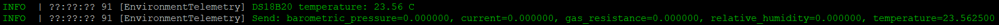

# DS18B20 Temperature Telemetry for Meshtastic Heltec Wireless Tracker

## Overview

This repository provides a small documentation and patch package that adds DS18B20 1-Wire temperature sensor support to the Meshtastic Environment Telemetry module for the Heltec Wireless Tracker.

The DS18B20 temperature value is published through the standard Meshtastic `environment_metrics.temperature` field. No protobuf changes are required.

This is not a full Meshtastic firmware fork. It only contains the files needed to reproduce the integration on top of the official Meshtastic firmware release.

## Tested Hardware

- Heltec Wireless Tracker
- PCB marking: HTIT-Tracker V1.2
- Meshtastic target: `heltec-wireless-tracker`
- Detected by Meshtastic as Heltec Wireless Tracker V1.1
- ESP32-S3
- DS18B20 temperature sensor, 3-wire mode

## Wiring

| DS18B20 / component | Heltec Wireless Tracker |
| --- | --- |
| DS18B20 VDD | 3.3V |
| DS18B20 GND | GND |
| DS18B20 DATA | GPIO 5 |
| 4.7 kOhm resistor | Between DATA and 3.3V |

## Meshtastic Version

This patch was developed and tested with:

```text
v2.7.15.567b8ea
```

The patch is intended to be applied on top of the official Meshtastic firmware tag above.

## Repository Contents

```text
README.md
ds18b20-heltec-wireless-tracker.patch
files/
  DS18B20Sensor.h
  DS18B20Sensor.cpp
logs/
  serial-log-example.png
```

The `files/` directory contains copies of the added sensor source files for easy review. The patch file is the source of truth for applying the full integration to Meshtastic.

## Applying the Patch

Clone the official Meshtastic firmware repository, check out the tested tag, initialize submodules, and apply the patch:

```bash
git clone https://github.com/meshtastic/firmware.git
cd firmware
git checkout v2.7.15.567b8ea
git submodule update --init --recursive
cp /path/to/ds18b20-heltec-wireless-tracker.patch .
git apply ds18b20-heltec-wireless-tracker.patch
```

The patch modifies:

- `src/modules/Telemetry/EnvironmentTelemetry.cpp`
- `src/modules/Telemetry/Sensor/DS18B20Sensor.h`
- `src/modules/Telemetry/Sensor/DS18B20Sensor.cpp`
- `variants/esp32s3/heltec_wireless_tracker/platformio.ini`

## Compiling

Build the Heltec Wireless Tracker PlatformIO environment:

```bash
pio run -e heltec-wireless-tracker
```

## Flashing

Flash this file:

```text
.pio/build/heltec-wireless-tracker/firmware.bin
```

Do not flash `firmware.factory.bin` for this use case. Use `firmware.bin`.

## Meshtastic Configuration

Enable Environment Telemetry in the Meshtastic application:

```text
Settings
-> Module Configuration
-> Telemetry
-> Enable Environment Telemetry
```

Also configure:

```text
Environment metrics update interval
```

For example:

```text
60 seconds
```

## Serial Log Example

Expected serial log lines include:

```text
Init sensor: DS18B20 on GPIO 5
DS18B20 initialized on GPIO 5
DS18B20 temperature: 24.94 C
Send: barometric_pressure=0.000000, current=0.000000, gas_resistance=0.000000, relative_humidity=0.000000, temperature=24.940001
```

Serial log screenshot:



## Notes / Limitations

- GPIO 5 is currently hardcoded.
- The integration is limited to `HELTEC_TRACKER_V1_1`.
- This is not yet a generic implementation ready for official upstream inclusion in Meshtastic.
- Data is sent through standard Meshtastic Environment Telemetry packets.
- Other Meshtastic nodes on the same channel can receive this telemetry.
